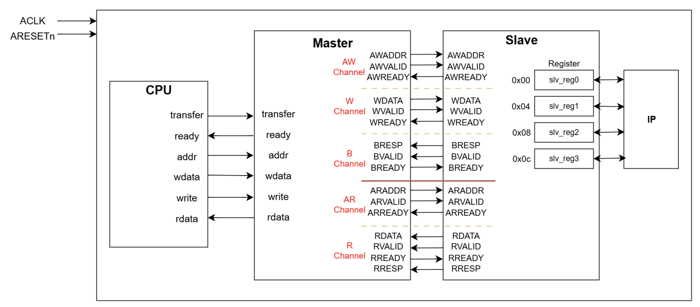
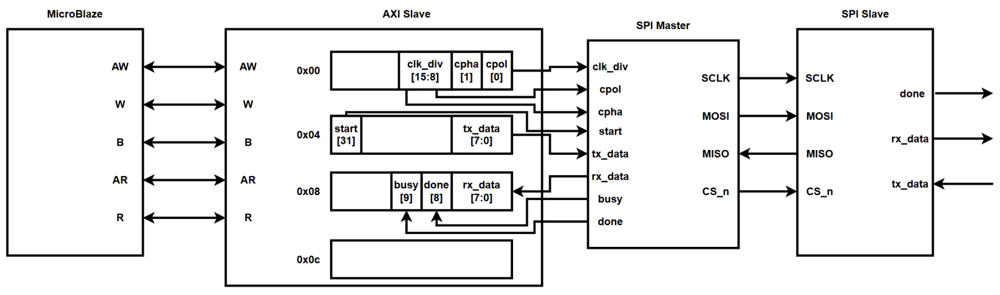
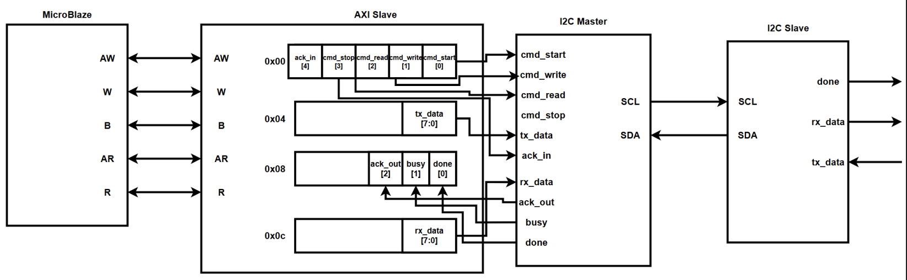
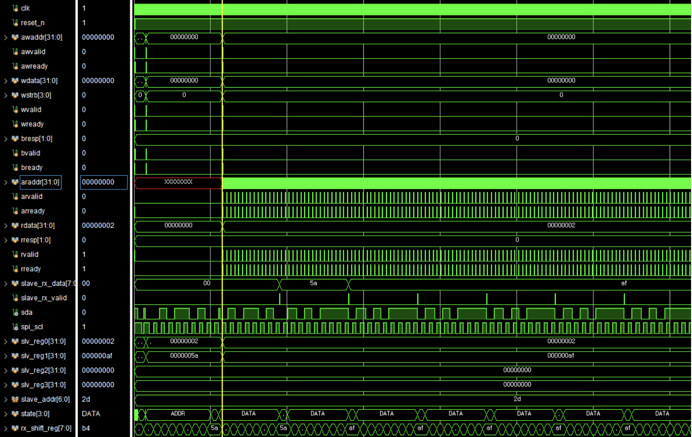
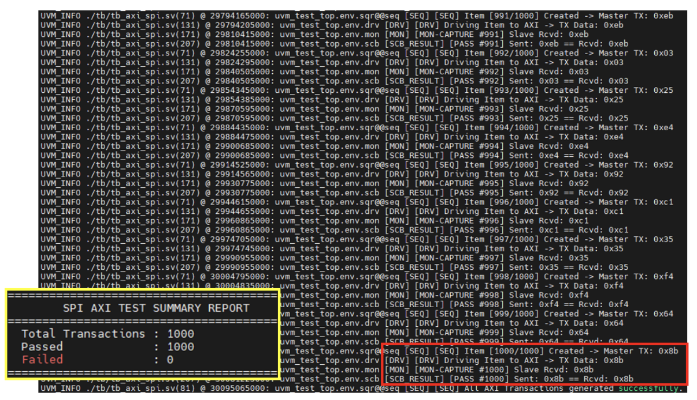
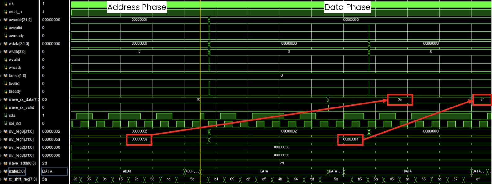

# 🔌 AXI4-Lite 기반 SPI & I2C 직렬 통신 설계 및 검증

> AXI4-Lite 버스 인터페이스를 기반으로 SPI/I2C Master IP를 설계하고,  
> FPGA 보드 2대를 활용하여 Board-to-Board 데이터 통신을 검증한 개인 프로젝트입니다.

---

## 📌 프로젝트 개요

MicroBlaze와 SPI/I2C 통신 모듈을 AXI4-Lite 인터페이스로 연결하여  
메모리 맵 기반의 주변장치 제어 시스템을 구현했습니다.

AXI Slave 내부 Register Map을 통해 통신 명령, 송신 데이터, 수신 데이터, 상태 정보를 관리하고,  
SPI와 I2C의 실제 데이터 송수신 흐름을 시뮬레이션과 FPGA 보드 간 통신으로 검증했습니다.

특히 I2C 통신 과정에서 발생한 수신 데이터 누락 문제를 분석하고,  
상태 레지스터의 Done bit를 Polling 방식으로 확인하는 동기화 로직을 적용해 해결했습니다.

---

## 📅 수행 기간

**2026.04.21 ~ 2026.05.07**

---

## 👤 프로젝트 형태

**개인 프로젝트**

SPI와 I2C의 실제 통신을 검증하기 위해 FPGA 보드 2대를 사용했습니다.

한 대는 Master, 다른 한 대는 Slave 역할로 구성했으며,  
전체 RTL 설계, AXI 연동, 소프트웨어 제어, 시뮬레이션 및 Board-to-Board 검증은 개인으로 수행했습니다.

---

## 🙋 주요 수행 내용

- AXI4-Lite 기반 SPI/I2C Master IP 연동 구조 설계
- AXI Master/Slave Read·Write Transaction 구조 분석
- AXI Slave Register Map 구성
- SPI Master 및 Slave 통신 모듈 구현
- I2C Master 및 Slave 통신 모듈 구현
- MicroBlaze와 SPI/I2C IP 연결
- 메모리 맵 기반 통신 제어 환경 구축
- Application–Driver–HAL–HW 계층 구조 구현
- FPGA 보드 2대를 활용한 Board-to-Board 통신 검증
- SystemVerilog/UVM 기반 SPI 통신 검증
- I2C 수신 데이터 누락 문제 분석 및 해결

---

## 🛠 사용 기술

### HDL & Verification

- Verilog HDL
- SystemVerilog
- UVM

### Bus & Protocol

- AXI4-Lite
- SPI
- I2C
- Memory-Mapped I/O
- Register Map
- FSM

### Hardware & Tools

- FPGA
- MicroBlaze
- Vivado
- Vitis
- Verdi

### Programming

- C

---

## 🏗 시스템 구성

MicroBlaze에서 발생한 제어 명령과 송신 데이터는 AXI Interconnect를 거쳐  
AXI Slave Register Map으로 전달됩니다.

Register Map에 저장된 제어값은 SPI 또는 I2C Master IP로 전달되며,  
Master IP가 실제 통신 신호를 생성해 상대 FPGA 보드의 Slave 모듈과 데이터를 송수신합니다.

<p align="center">
  
</p>

<p align="center">
  <b>AXI4-Lite 기반 전체 시스템 구성</b>
</p>

---

## 🔄 AXI4-Lite 인터페이스

AXI4-Lite는 다음 5개의 독립 채널로 구성됩니다.

| 채널 | 기능 |
| --- | --- |
| AW | Write Address Channel |
| W | Write Data Channel |
| B | Write Response Channel |
| AR | Read Address Channel |
| R | Read Data Channel |

Write Transaction에서는 주소와 데이터가 각각 AW, W 채널을 통해 전달되고,  
Slave는 B 채널을 통해 응답을 반환합니다.

Read Transaction에서는 AR 채널로 읽을 주소를 전달하고,  
R 채널을 통해 요청한 데이터를 반환받습니다.

---

## 🗂 SPI / I2C AXI Bridge

AXI Slave 내부 Register Map을 통해 SPI와 I2C의 제어 명령, 송신 데이터,  
수신 데이터 및 상태 정보를 관리하도록 구성했습니다.

<table>
  <tr>
    <th>SPI AXI Bridge</th>
    <th>I2C AXI Bridge</th>
  </tr>
  <tr>
    <td align="center">
      
    </td>
    <td align="center">
      
    </td>
  </tr>
</table>

### SPI Register Map

| Offset | Register | 주요 내용 |
| --- | --- | --- |
| `0x00` | Control Register | `clk_div`, `CPOL`, `CPHA` |
| `0x04` | TX Register | `start`, `tx_data` |
| `0x08` | RX / Status Register | `busy`, `done`, `rx_data` |
| `0x0C` | Reserved | 예약 영역 |

### I2C Register Map

| Offset | Register | 주요 내용 |
| --- | --- | --- |
| `0x00` | Command Register | `cmd_start`, `cmd_write`, `cmd_read`, `cmd_stop`, `ack_in` |
| `0x04` | TX Register | `tx_data` |
| `0x08` | Status Register | `ack_out`, `busy`, `done` |
| `0x0C` | RX Register | `rx_data` |

---

## ⚠️ 문제 해결

### I2C 수신 데이터 누락 문제

| 구분 | 내용 |
| --- | --- |
| 문제 | I2C 수신 시 값이 누락되거나 이전 통신의 값이 읽히는 현상 발생 |
| 원인 | 통신 완료 전 RX Register에 접근 |
| 해결 | Status Register의 Done bit를 Polling 방식으로 확인 |
| 결과 | 하드웨어 Transaction 완료 후 데이터를 읽어 수신 안정성 확보 |

<p align="center">
  
</p>

<p align="center">
  <b>I2C 수신 데이터 누락 원인 분석 파형</b>
</p>

---

## ✅ 검증 내용

### AXI4-Lite 검증

- AW, W, B 채널 기반 Write Transaction 확인
- AR, R 채널 기반 Read Transaction 확인
- Register별 Address Mapping 검증
- Command 및 TX Data 전달 흐름 확인
- RX Data와 Status Register Read 동작 확인

### SPI 검증

- SCLK, MOSI, MISO, CS_n 신호 동작 확인
- CPOL/CPHA 설정에 따른 SPI Timing 검증
- Master-Slave 데이터 송수신 확인
- Busy/Done 상태 변화 확인
- SystemVerilog/UVM 기반 무작위 Transaction 검증

### I2C 검증

- START, WRITE, READ, STOP 동작 확인
- SDA/SCL 기반 데이터 송수신 확인
- ACK 신호 처리 확인
- Status Register 기반 통신 완료 시점 확인
- Board-to-Board 수신 데이터 일치 여부 확인

---

## 📊 검증 결과

### SPI UVM 검증

<p align="center">
  
</p>

<p align="center">
  <b>SPI UVM 검증 결과</b>
</p>

```text
Total Transactions : 1000
Passed             : 1000
Failed             : 0
```

1000개의 무작위 Transaction에 대해 Master 송신 데이터와 Slave 수신 데이터를  
Scoreboard로 비교한 결과, 모든 Transaction이 정상적으로 일치했습니다.

---

### I2C 정상 수신 결과

<p align="center">
  
</p>

<p align="center">
  <b>Polling 동기화 적용 후 I2C 정상 수신 파형</b>
</p>

Status Register의 Done bit를 Polling 방식으로 확인한 뒤 RX Register에 접근하도록 수정했습니다.  
그 결과 수신 데이터 누락 없이 정상적으로 데이터가 전달되는 것을 확인했습니다.

---

### Board-to-Board 통신 검증

- FPGA 보드 2대를 각각 Master와 Slave로 구성
- SPI 데이터 송수신 정상 동작 확인
- I2C 데이터 송수신 정상 동작 확인
- 송신 데이터와 수신 데이터의 일치 여부 확인
- 반복 통신 환경에서 안정적인 데이터 전달 확인
---

## 📂 프로젝트 구조

AXI4-Lite 기반 SPI 및 I2C RTL, 테스트벤치, MicroBlaze 소프트웨어와 FPGA 제약조건은 `src` 폴더에 정리했습니다.

```text
.
├── src/
│   ├── rtl/
│   │   ├── spi/
│   │   │   ├── axi/
│   │   │   │   ├── SPI_v1_0.v
│   │   │   │   └── SPI_v1_0_S00_AXI.v
│   │   │   ├── spi_master.sv
│   │   │   ├── spi_slave.sv
│   │   │   └── spi_slave_top.sv
│   │   └── i2c/
│   │       ├── axi/
│   │       │   ├── I2C_v1_0.v
│   │       │   └── I2C_v1_0_S00_AXI.v
│   │       ├── i2c_master.sv
│   │       └── top_i2c_slave.sv
│   ├── sim/
│   │   ├── spi/
│   │   │   ├── tb_axi_spi_rtl.sv
│   │   │   └── tb_axi_spi_full_rtl.sv
│   │   └── i2c/
│   │       ├── tb_axi_i2c_rtl.sv
│   │       └── tb_axi_i2c_full_rtl.sv
│   ├── software/
│   │   ├── spi/
│   │   └── i2c/
│   └── constraints/
│       ├── spi_basys3.xdc
│       └── i2c_basys3.xdc
├── docs/
├── images/
└── README.md
```

> 실제 프로젝트 파일 구성에 맞게 폴더명과 파일명은 수정할 예정입니다.

---

## 💡 프로젝트를 통해 배운 점

AXI4-Lite의 독립적인 Read/Write 채널 구조와  
Memory-Mapped I/O 기반의 하드웨어 제어 방식을 이해할 수 있었습니다.

또한 SPI와 I2C처럼 상대적으로 느린 물리 통신을  
고속 AXI 시스템과 연결할 때는 단순한 데이터 전달뿐 아니라  
Busy/Done 상태를 활용한 정확한 동기화가 중요하다는 점을 경험했습니다.

시뮬레이션 파형과 실제 FPGA 보드 통신 결과를 함께 분석하며  
RTL 설계, 소프트웨어 제어, 버스 인터페이스, 실제 하드웨어 검증을 연결하는 경험을 쌓았습니다.

---

## 📄 발표 자료

전체 시스템 설계 및 검증 과정은 아래 발표 자료에서 확인할 수 있습니다.

<p align="center">
  <a href="docs/260508_axi_spi_i2c.pdf">
    <b>📑 프로젝트 발표 자료 보기</b>
  </a>
</p>
